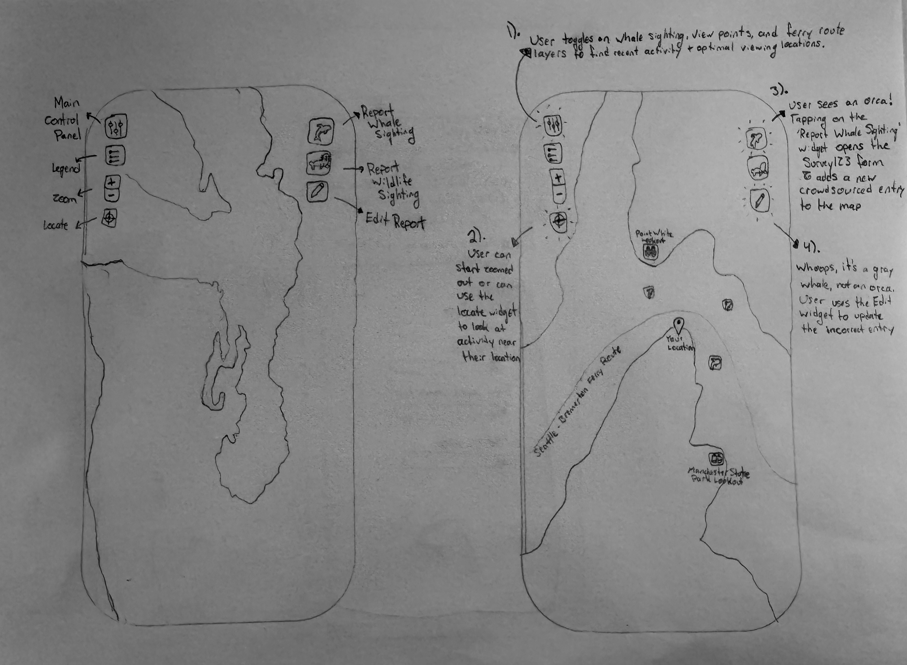
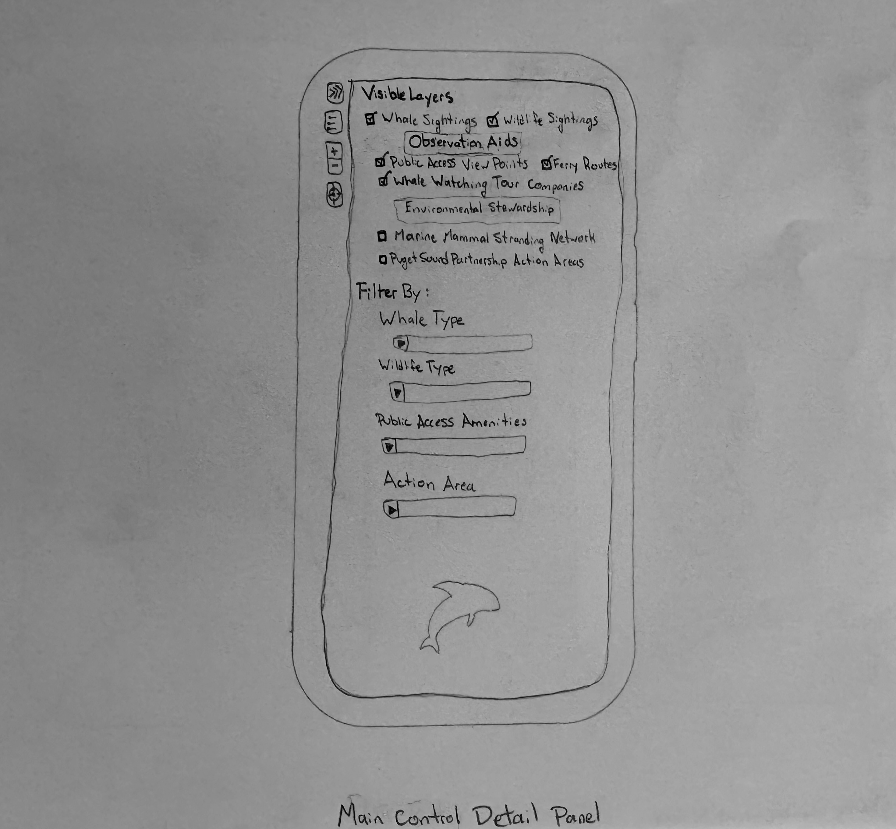
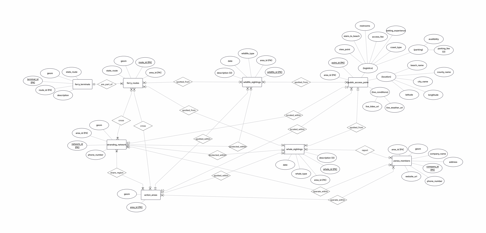

# Puget Sound Watch

**Puget Sound Watch** is a serverless, mobile-first geospatial web application designed to facilitate real-time whale-watching and marine wildlife reporting within a framework of regional environmental stewardship across the Puget Sound region.

> **Geography 576**  
> **Author:** Hope McBride  
> **Term:** Summer 2026 | University of Wisconsin–Madison  

---

## 1. App Name & Problem Statement

* **App Name:** Puget Sound Watch  
* **Purpose:** Facilitate real-time whale-watching and wildlife reporting within a framework of regional environmental stewardship in the Puget Sound region.  
* **Target Audience:** Citizen Scientists and Whale-Watching Enthusiasts.  

### Problem Statement & Technical Solution
Within the public sector, most existing whale-tracking applications function merely as static digital logs for whale sightings, separating raw observation data from the operational resources needed for active coastal stewardship. Such applications rarely account for secondary marine wildlife or integrate regional environmental stewardship infrastructures into their design.

Puget Sound Watch resolves this disconnect by deploying a responsive web map application that merges dynamic user data with pre-established wildlife observation vantage points and conservation layers. Through the web application, users can perform several distinct actions:

* **Add Sighting Reports:** Submit real-time spatial data points for both whale and general marine wildlife sightings via two embedded survey response widgets.
* **Cross-Reference Infrastructure:** Overlay active sighting clusters with Washington State Department of Transportation (WSDOT) ferry routes and public shoreline access points to strategically plan land- and vessel-based viewing opportunities.
* **Execute Spatial Queries:** Select localized geographic boundaries, such as the Washington State Puget Sound Partnership (WAPSP) Action Areas, to filter out extraneous data and isolate wildlife activity occurring strictly within their specific environmental zone.
* **Coordinate Incident Response:** Access an interactive layer displaying NOAA’s West Coast Marine Mammal Stranding Network's operational zones in the event of a stranded marine mammal emergency. Clicking a zone reveals dedicated contact channels for the specific local response group handling that sector, reducing critical response times.

---

## 2. Data Table

| Dataset Name | Layer Type | Data Source / URL | Use in App |
| :--- | :--- | :--- | :--- |
| **Esri's World Ocean Base** | Tile Raster | Esri, GEBCO, NOAA, Garmin `https://services.arcgisonline.com/ArcGIS/rest/services/Ocean/World_Ocean_Base/MapServer` | Basemap designed for marine-specific GIS projects; provides bathymetry and shaded relief imagery. |
| **Shoreline Public Access Points** | Point Feature Layer | WA Dept. of Ecology (Shorelands & Environmental Assistance) `https://services.arcgis.com/HRPe58bUyBqyyiCt/arcgis/rest/services/PublicBeachAccess_Points_ViewPointTrue_PgtSnd_Rural/FeatureServer` | Locations for public viewing points along the Puget Sound coast, including accessibility, facilities, and live tide/weather links. Note: The layer used in this project is a subset of the original WDOE layer and includes only relevant points (selected in ArcGIS Pro by H. McBride) where View_Point = Yes AND Setting_Experience = True. |
| **WSDOT Ferry Routes** | Point/Line Feature Layer | Washington State Department of Transportation `https://data.wsdot.wa.gov/arcgis/rest/services/Shared/FerryRoutes/MapServer/1` | Ferry routes across Puget Sound; helps users cross-reference active whale sightings with transit paths to improve viewing opportunities. |
| **Pacific Whale Watch Association Members** | Point Feature Layer | PWWA (Compiled by H. McBride) `https://services.arcgis.com/HRPe58bUyBqyyiCt/arcgis/rest/services/pacific_whale_watch_association_members/FeatureServer` | Contact details and operator locations for regional whale-watching tour companies. |
| **West Coast Marine Mammal Stranding Network** | Line Feature Layer | NOAA Fisheries West Coast Region / USFWS `https://services2.arcgis.com/C8EMgrsFcRFL6LrL/arcgis/rest/services/Live_Marine_Mammal_Stranding_Network_Live/FeatureServer` | Emergency response boundary zones displaying local telephone contacts for reporting stranded marine mammals. |
| **WAPSP Action Areas** | Polygon Feature Layer | Washington State Puget Sound Partnership `https://services7.arcgis.com/iAd79FjHxHKsLP0y/arcgis/rest/services/WAPSP_Action_Areas/FeatureServer` | Defines the seven Puget Sound Action Area boundaries used to spatially query and filter intersecting features. |
| **Crowdsourced Whale Sightings** | Hosted Point Feature Layer | Survey123 / AGOL (H. McBride) `https://services.arcgis.com/HRPe58bUyBqyyiCt/arcgis/rest/services/survey123_7ea959f0dc7e41cca7afa3a2b4e6cd63_results/FeatureServer` | User-editable feature layer storing crowdsourced whale sightings captured via Survey123. |
| **Crowdsourced Wildlife Sightings** | Hosted Point Feature Layer | Survey123 / AGOL (H. McBride) `https://services.arcgis.com/HRPe58bUyBqyyiCt/arcgis/rest/services/survey123_3afb8b1d28264a8ca054fae92a591ba7_results/FeatureServer` | User-editable feature layer storing crowdsourced general marine wildlife (non-whale) sightings. |

---

## 3. The Tech Stack

* **Frontend Libraries:** The client-side interface is built using **HTML, CSS, and the ArcGIS Maps SDK for JavaScript**, hosted via **GitHub Pages**. Hosting on GitHub Pages eliminates the need to provision dedicated server hardware, while the ArcGIS SDK provides production-ready UI widgets (e.g., `Locate`, `Legend`, `Expand`, `Editor`).
* **Backend Framework:** The application utilizes a serverless architecture powered by **ArcGIS Online (AGOL)** to host read-only reference layers and editable Hosted Feature Layers. AGOL natively manages spatial data publishing, spatial querying, and user-access security rules via open **ArcGIS REST APIs**, automatically scaling to handle high-volume citizen-science traffic.
* **Database:** User-generated sighting data is collected through integrated **ArcGIS Survey123** web form widgets. Survey123 handles client-side requests directly to write georeferenced point geometries and attributes directly into AGOL cloud databases.

---

## 4. Core Features

* **Data Uploading:** Real-time data entry through an embedded Survey123 web form widget captures species type, descriptions, and map coordinates. Users tap an *"Add Report"* button to open the survey. Upon form submission, the application utilizes a low layer refresh interval to seamlessly add new points to the map view without requiring a browser refresh.
* **Data Editing:** Real-time data editing through an embedded `Editor` widget allows users to update crowdsourced whale and wildlife entries directly within the map. Users select the entry they wish to update, save changes, and close the widget to integrate modifications instantly.
* **Dynamic Filtering:** Interactive UI controls allow users to toggle layer visibility and filter sightings and coastal access points by attribute parameters (e.g., parking, restrooms, species).
* **Serverless Spatial Querying:** Users can isolate features by region using the WAPSP Action Areas layer. Selecting an Action Area executes a spatial query via the ArcGIS REST API to dynamically isolate features that fall within the selected polygon boundary.

---

## 5. Wireframes

---

## 6. Entity-Relationship (ER) Diagram

| Entity | Attributes | Purpose |
| :--- | :--- | :--- |
| **Public Access Points** | `Point_id` [PK], `view_point`, `stairs_to_beach`, `restrooms`, `access_fee`, `setting_experience`, `coast_type`, `parking_availability`, `parking_fee`, `live_tides_url`, `live_weather_url`, `beach_name`, `county_name`, `city_name`, `geom`, `Area_id` [FK] | Displays coastal viewing spots; filterable by amenities. |
| **WSDOT Ferry Routes** | `Route_id` [PK], `geom`, `state_route`, `Area_id` [FK] | Displays WSDOT marine transit paths. |
| **PWWA Members** | `Company_id` [PK], `company_name`, `website_url`, `phone_number`, `geom`, `address`, `Area_id` [FK] | Displays locations of commercial whale-watching organizations. |
| **Stranding Network** | `Network_id` [PK], `phone_number`, `geom`, `Area_id` [FK] | Linear zones for locating regional stranded marine mammal contact groups. |
| **WAPSP Action Areas** | `Area_id` [PK], `geom` | Reference polygon regions used for spatial querying across feature layers. |
| **Crowdsourced Whales** | `Whale_id` [PK], `whale_type`, `date`, `description`, `geom`, `Area_id` [FK] | Hosted Feature Layer capturing crowdsourced whale observation points. |
| **Crowdsourced Wildlife** | `Wildlife_id` [PK], `wildlife_type`, `date`, `description`, `geom`, `Area_id` [FK] | Hosted Feature Layer capturing other marine mammal/bird observation points. |

---

## 7. Scope and Feasibility

To mitigate interface clutter and complexity on small screens, the application initializes with a clean, uncluttered basemap view. Users can add desired layers on demand via the custom control panel. 

Primary project focus remains on the Puget Sound region, leveraging open data layers from WSDOT, the WA Department of Ecology, and NOAA. The main technical constraint is the mobile-first design priority, ensuring structured and clear navigation across handheld devices. 

* **Minimum Viable Product (MVP):** A responsive, mobile-friendly map dashboard featuring clean UI layer-toggles, two embedded Survey123 web forms writing to AGOL Hosted Feature Layers, and basic attribute filtering.
* **Stretch Goals:** Multi-parameter attribute filtering and a client-side spatial query tool for the Action Areas layer using `FeatureLayer.createQuery()`.